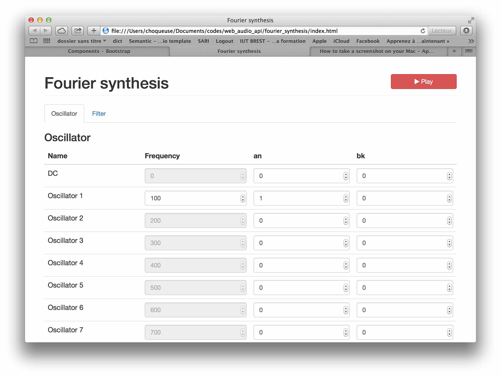

# Fourier_synthesis_web_audio

This application implements a periodic signal synthesizer. This synthesizer includes several functionalities
* Synthesis of Periodic waveforms from the Fourier Coefficient
* Filtering of Periodic waveforms.

This application is based on the [Web audio API](http://webaudio.github.io/web-audio-api/). This API requires a modern browser (see list of supported [browser](http://caniuse.com/#feat=audio-api) )